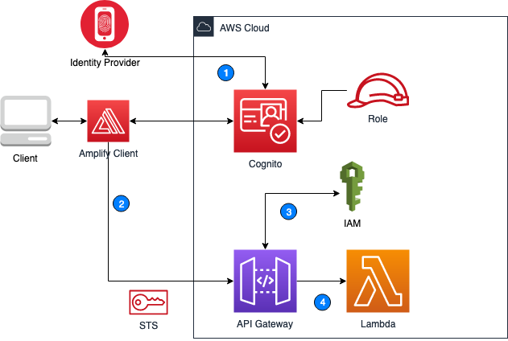

# Amplify Client with Okta OIDC #
This article focuses on how to setup an ODIC in Cognito and leverage Amplify Client to handle Authenticate and Authorization.  The Amplify Client can handle flows needed to access a protected API Gateway using IAM Authorization. The Amplify CLI is used to create the following resources but is not required to use Amplify Client.
* API Gateway - Authorization via IAM
* Cognito UserPools & IdentityPools
* Lambda
* IAM Roles
* React App
* Cloudfront
* S3 Bucket

## Architecture ##


## Client Flow ##
1. Client Authenticates w/ Identity Provider via Cognito OpenID Connect
    - Upon successful authentication, Cognito will receive a code grant
    - The code grant is negotiated for a JWT token with Okta
    - A Cognito JWT token is returned to the application
    - An STS token is also returned that is tied to a role that allows access to invoke ApiGateway
    - https://docs.aws.amazon.com/STS/latest/APIReference/API_AssumeRoleWithWebIdentity.html

2. User makes a call to the backend resource (API Gateway)
    - STS token is passed in Header
    - Amplify Client handles API call

3. STS token is verified via IAM
    - STS token is tied to IAM Role for permissions

4. API Gateway invokes Lambda and passes event
    

## Getting Started ##
1. Configure Amplify CLI https://docs.amplify.aws/cli/start/install/
2. Install React Dependencies 
    ``` bash
    npm install 
    ```
3. Init Amplify inside App root
    ``` bash
    amplify init
    ```
4. Amplify add auth
    ``` bash
    amplify add auth 
    ```
5. Follow directions to add Okta OIDC https://aws.amazon.com/premiumsupport/knowledge-center/cognito-okta-oidc-identity-provider/
6. Configure `/src/oidc-env.js` to hold Okta OIDC params
7. Amplify add api (API Gateway) with authenticated users only
    ``` bash
    amplify add api
    ```
8. Start React App
    ``` bash
    npm start
    ```
8. When testing is complete host app via Amplify
    ``` bash
    amplify add hosting
    ```

## Resources ##
- Amplify Client Auth Library https://docs.amplify.aws/lib/auth/getting-started/
- Amplify Client Config Categories https://docs.amplify.aws/lib/client-configuration/configuring-amplify-categories/q/platform/js/#top-level-configuration-5
- Setup Okta OIDC with Cognito https://aws.amazon.com/premiumsupport/knowledge-center/cognito-okta-oidc-identity-provider/
- IAM for API Gateway https://aws.amazon.com/premiumsupport/knowledge-center/iam-authentication-api-gateway/
- AWS Amplify, Amazon Cognito, and an OpenID Connect Identity Provider https://aws.amazon.com/blogs/mobile/building-an-application-with-aws-amplify-amazon-cognito-and-an-openid-connect-identity-provider/